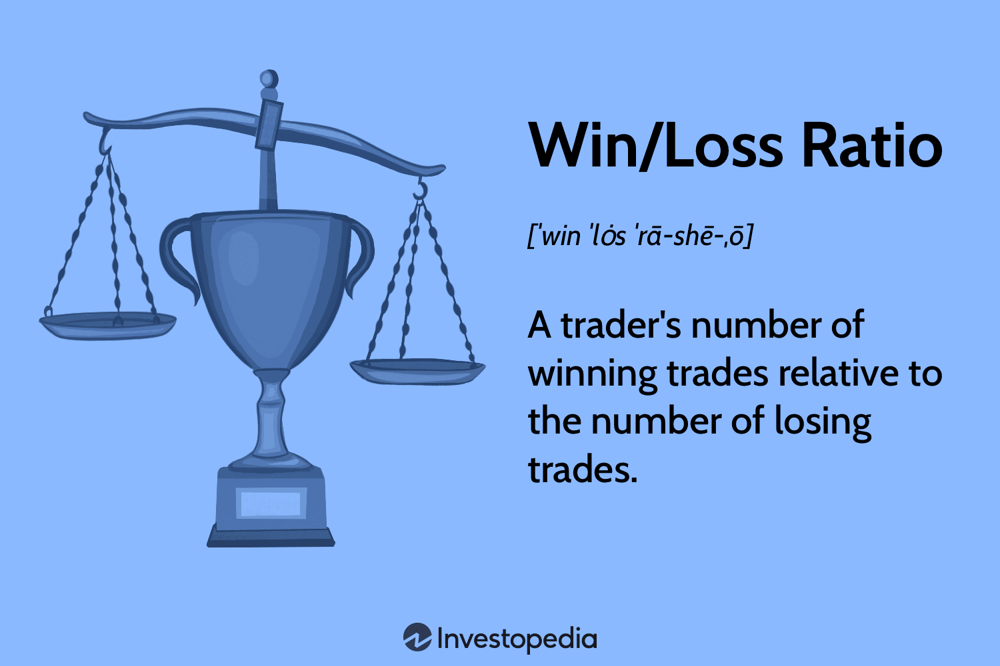
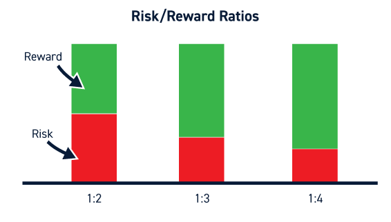

# Position Size Optimizer

## Financial Markets

A [financial market](https://en.wikipedia.org/wiki/Financial_market) is a market in which people trade financial securities and derivatives at low transaction costs. Some of the securities include stocks and bonds, raw materials, and precious metals, which are known in the financial markets as commodities.

## Market Sentiment

As the time I started to write this article, Federal Reserve's tightening is going to change in a near future since its effects on the United States economy and we would see a huge rise in financial markets, but before that, as they haven't decided about the final interest rate, we have stuck in a range market, therefore, the best strategy you might choose for capital increasing is buy-in **Demand** zones and sell in **Supply** zones.

"The expected path of the federal funds rate implied by a straight read of financial market quotes rose notably over the intermeeting period, largely reflecting more-restrictive-than-expected monetary policy communications and data releases that pointed to inflation moving down more slowly than previously expected. On net, nominal Treasury yields increased across the maturity spectrum. The increases in nominal yields at medium and longer-term horizons were primarily accounted for by higher real yields, though inflation compensation measures rose as well." [November 2022 FOMC Minutes](https://www.federalreserve.gov/monetarypolicy/files/fomcminutes20221102.pdf)

## Risk Management

Suppose you're a beginner trader in financial markets such as [NASDAQ](https://www.nasdaq.com/) or [Cryptocurrencies](https://coinmarketcap.com/). As you know one of the most important factors in trading is risk/emotion management.

## I'm not a robot

As **[Prospect Theory](https://en.wikipedia.org/wiki/Prospect_theory)** which was developed by [Daniel Kahneman](https://en.wikipedia.org/wiki/Daniel_Kahneman) tells us, you are affected by your losses more than your gains Hence you've to go through financial markets by your logic.

## The Problem

As you're a beginner trader, let me assume your **win-rate** to **50%** and your **risk/reward** to **1:2** which I point it R&R from now.

_Win-rate definition_: Your win rate shows how many trades you win out of all your trades. For example, if you make five trades a day and win three, your daily win rate is three out of five, or 60%. If there are 20 trading days in the month, and you win 60 out of 100 trades, your monthly win rate is 60%.

_R&R definition_: The risk/reward ratio marks the prospective reward an investor can earn for every dollar they risk on an investment. Many investors use risk/reward ratios to compare the expected returns of an investment with the amount of risk they must undertake to earn these returns.

Back to the main problem. So you have had **1000$** as your **initial investment**.

### Example

Frankly speaking, since your win rate equals 50%, So your trades are supposed to be win-loss-win-loss-win-loss..., However, your R&R is 2, so in each step, you win, your capital is raised two times then lost. Thus

### $$ Position Sizing = 70\% $$

1. **WIN**: $$ 1000\$ * 70\% = 700\$ \xrightarrow{+1400\$} Cap = 1000\$ + 1400\$ = 2400\$ $$
2. **LOSS**: $$ 2400\$ * 70\% = 1680\$ \xrightarrow{-1680\$} Cap = 2400\$ - 1680\$ = 720\$ $$
3. **WIN**: $$ 720\$ * 70\% = 504\$ \xrightarrow{+1008\$} Cap = 720\$ + 1008\$ = 1728\$ $$
4. **LOSS**: $$ 1728\$ * 70\% = 1209.6\$ \xrightarrow{-1209.6\$} Cap = 1728\$ - 1209.6\$ = 518.4\$ $$
5. **WIN**: $$ 518.4\$ * 70\% = 362.88\$ \xrightarrow{+725.76\$} Cap = 518.4\$ + 725.76\$ = 1244.16\$ $$
6. **LOSS**: $$ 1244.16\$ * 70\% = 870.912\$ \xrightarrow{-870.912\$} Cap = 1244.16\$ - 870.912\$ = 373.248\$ $$

### $$ Position Sizing = 10\% $$

1. **WIN**: $$ 1000\$ * 10\% = 100\$ \xrightarrow{+200\$} Cap = 1000\$ + 200\$ = 1200\$ $$
2. **LOSS**: $$ 1200\$ * 10\% = 120\$ \xrightarrow{-120\$} Cap = 1200\$ - 120\$ = 1080\$ $$
3. **WIN**: $$ 1080\$ * 10\% = 108\$ \xrightarrow{+216\$} Cap = 1080\$ + 216\$ = 1296\$ $$
4. **LOSS**: $$ 1296\$ * 10\% = 129.6\$ \xrightarrow{-129.6\$} Cap = 1296\$ - 129.6\$ = 1166.4\$ $$
5. **WIN**: $$ 1166.4\$ * 10\% = 116.64\$ \xrightarrow{+233.28\$} Cap = 1166.4\$ + 233.28\$ = 1399.68\$ $$
6. **LOSS**: $$ 1399.68\$ * 10\% = 139.968\$ \xrightarrow{-139.968\$} Cap = 1399.68\$ - 139.968\$ = 1259.712\$ $$

## What is the most efficient position sizing?

[see more](https://github.com/mr-seifi/position-sizing-optimizer/position_optimizer.ipynb)
